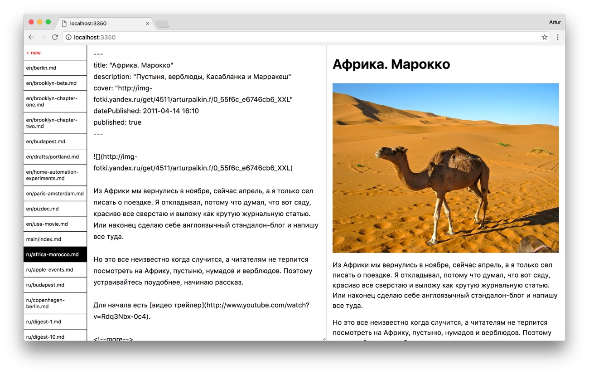

# Tent

Experimental admin interface to static sites / notes / whatever. Editor for Markdown body, YAML frontmatter fields and a live preview. Built with yo-yo. WIP.




## Features

* Separate components that you can mix and match
* Supports deeply nested fields, objects and arrays

## Usage

```sh
npm install
npm start
```
